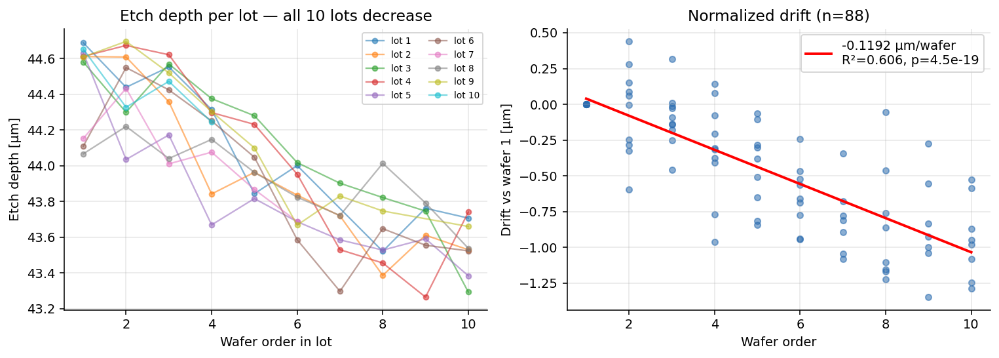
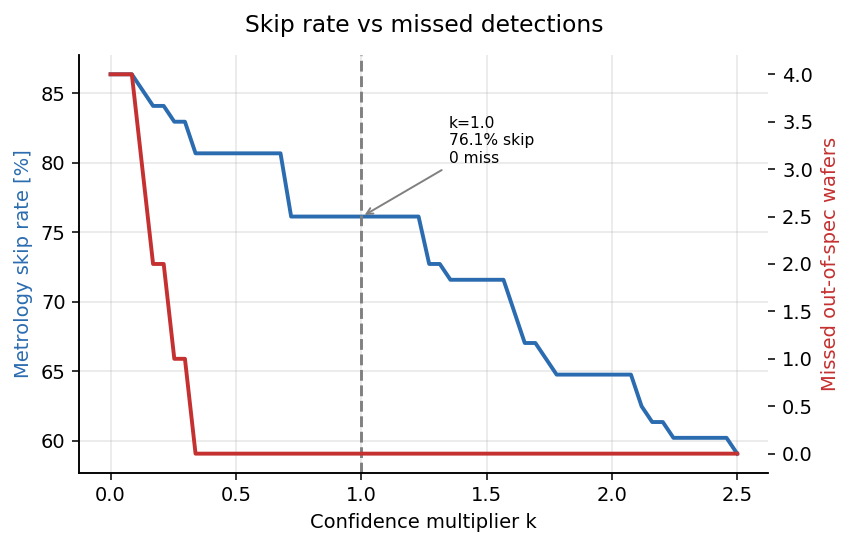
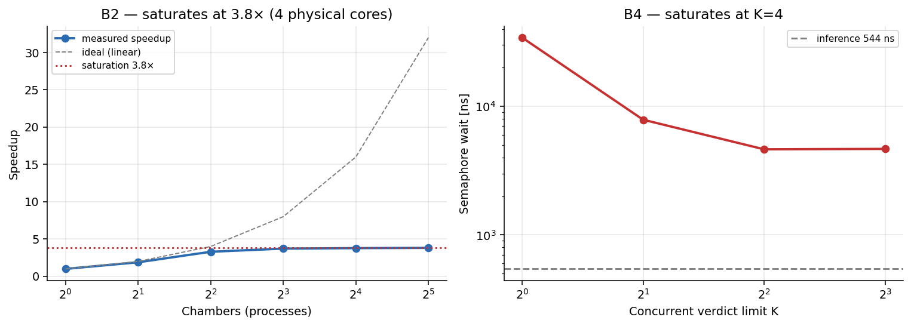
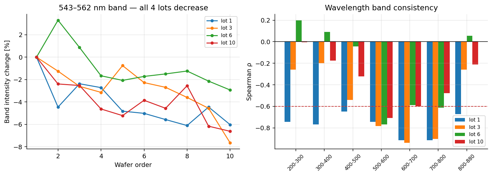

# 플라즈마 식각 가상계측 — 드리프트 인과 분석부터 임베디드 실장까지

반도체 BOSCH 식각 공정에서 **챔버 상태 드리프트를 발견하고, 원인을 규명하고, 센서만으로 식각 깊이를 예측한 뒤, 임베디드 보드에 실장해 하드웨어 한계를 측정**한 프로젝트.

공개 데이터셋(공정 파라미터 + OES 스펙트럼)을 사용했으며, **원저자가 "결론에 이르지 못했다(inconclusive)"고 기록한 문제**를 분석 대상으로 삼았다.

팹리스점프업 2기 부가 프로젝트.

---

## 핵심 결과 4줄

| | 결과 |
|---|---|
| **드리프트 규명** | 클리닝 없이 10장 연속 처리 시 식각 깊이 **−0.119 µm/wafer** 단조 감소 (10/10 lot, p=4.5×10⁻¹⁹). 원인은 RF 정합 특성 변화이며, **압력·설정파워는 변화 0.000** (음성 대조군) |
| **예측 + 판정** | 센서 3개 + 웨이퍼 순서로 **공정 시작 4.8초 만에** 깊이 예측 (LOLO R²=0.855). 불확실성 기반 판정으로 **실계측 76.1% 생략, 규격이탈 미검출 0/67** (95% 상한 5.4%) |
| **임베디드 실장** | ARM64 이식 후 PC 대비 오차 **1.0×10⁻⁵ µm**. 실시간 5 Hz 마감 여유율 **190만 배**, 16챔버 동시 마감초과 **0/880** |
| **인과 독립 검증** | OES 3,648채널 분석에서 **543–562 nm 대역 발광이 4개 lot 전부에서 단조 감소** (ρ=−0.73~−0.83, p<0.02). 전기적 증거를 광학적으로 뒷받침 |



---

## 왜 이 프로젝트인가

가상계측(Virtual Metrology)은 **웨이퍼를 실제로 재보지 않고 장비 센서만으로 결과 물성값을 예측**하는 기술이다. 실계측은 비싸고 느려서 표본만 재는데, 그 사이 이상이 생기면 이미 여러 장이 망가진다.

```
전통 방식   처리 → (대기) → 계측장비 이동 → 실측 → 이상 발견 ← 이미 늦음

가상계측    처리 중 센서 스트림 → 실시간 예측 + 불확실성
              ├ 확신 있게 규격 내  → 실계측 생략   (throughput ↑)
              ├ 확신 있게 규격 밖  → 조기 중단     (손실 ↓)
              └ 애매함            → 실계측으로 이관
```

**이 프로젝트가 만든 것은 예측 모델이 아니라 위 3분기 판정기다.** 정확도만 높은 모델은 쓸모가 없다. "얼마나 확신하는가"를 함께 내놓아야 생략 여부를 결정할 수 있기 때문이다.

---

## 1. 드리프트 발견과 원인 규명

### 관측

lot별 1번 웨이퍼 기준 정규화한 평균 식각 깊이:

| 순서 | 1 | 2 | 3 | 4 | 5 | 6 | 7 | 8 | 9 | 10 |
|---|---|---|---|---|---|---|---|---|---|---|
| 드리프트 [µm] | 0.000 | −0.043 | −0.097 | −0.319 | −0.439 | −0.644 | −0.805 | −0.848 | −0.854 | **−0.941** |

**−0.1192 µm/wafer, R²=0.606, p=4.53×10⁻¹⁹.** 10개 lot 전부 단조 감소, 9개가 개별 p<0.005.

> 회귀의 p값을 신뢰하지 않더라도 **10개 lot 전부 감소**라는 사실만으로 부호검정 p=0.001이다. 결론이 특정 통계 가정에 의존하지 않는다.

### 원인 신호

lot 내 정규화 후 w1→w10 변화량과 깊이의 Spearman 상관:

| 신호 | w1→w10 | ρ(깊이) | p |
|---|---|---|---|
| Source RF 반사파워 | **+0.909** ↑ | −0.577 | 4.0×10⁻⁹ |
| Source RF peak-to-peak | **−6.035** ↓ | +0.716 | 4.4×10⁻¹⁵ |
| Platen RF 튜닝 커패시터 | **+0.301** ↑ | −0.857 | 1.6×10⁻²⁶ |

> 상관은 **플라즈마 ON 구간**(`SourceRFLoadPower > 2000 W`, 중앙값 2,991 샘플)에 한정해
> 계산했다. 전체 시계열 평균을 쓰면 대기·펌핑 구간이 신호를 희석해 pk-pk의 ρ가
> 0.716 → 0.364로 절반이 된다. (`src/03_corr.py` vs `src/03b_corr_plasma.py`로 비교 가능)

### ★ 음성 대조군 — 논증을 닫는 부분

| 신호 | w1→w10 변화 | 88장 전체 표준편차 |
|---|---|---|
| 챔버 압력 (`Pressure`) | **+0.0000** | **0.0000** |
| Platen RF 파워 (`PlatenRFLoadPower`) | −0.0266 | 0.0518 |

챔버 압력은 88 웨이퍼 전체 표준편차가 **정확히 0**이다. 단 한 번도 움직이지 않았다.

**레시피 설정은 완전히 고정된 상태에서 RF 정합 특성만 악화된다.** 상관을 찾는 것은 쉽지만, "변하지 않아야 할 것이 실제로 변하지 않았음"을 보이려면 의도적으로 설계해야 한다.

### 걸러낸 신호 — 정직성의 근거

| 신호 | 문제 | 판단 |
|---|---|---|
| `PlatenDcBias` | 원시 ρ=+0.49 → lot 정규화 후 **−0.33** (부호 반전) | lot 간 조건 차이가 만든 착시. **사용 안 함** |
| `EpdIntensity` | 평균 2.26인데 w1→w10 변화 −18.7 | 간헐적 이진 신호. 평균 통계 무의미. **사용 안 함** |

---

## 2. 모델 선택 — 65개 조합 전수 비교

**5개 특징셋 × 13개 모델 = 65조합**을 Leave-One-Lot-Out 교차검증으로 전수 측정했다. ([전체 표](model_comparison_full.csv))

> 표 파일은 68행이다 — 위 65조합에 순서만 baseline 1행, 28특징 구성의 PLS
> `k=5, 8` 2행이 더해진다. `python src/05_models.py` 는 68행을 그대로 재생성하고
> 기준표와 자동 대조한다.

| 구성 | 최고 모델 | R² | fold_sd |
|---|---|---|---|
| 웨이퍼 순서만 (1특징) | Ridge | 0.7019 | 0.0349 |
| 1사이클 RF3만 (3특징) | GPR-RBF | **0.1430** | 0.0835 |
| **1사이클 RF3 + 순서 (4특징)** | GPR-Matern | **0.8775** | 0.0496 |
| 전공정 RF3 + 순서 (4특징) | GPR-Matern | 0.9058 | 0.0383 |
| 전공정 27파라미터 + 순서 (28특징) | **LassoCV** | **0.9325** | 0.0204 |

### 표에서 읽어야 할 것

**① 센서가 카운터보다 낫다 — 단, 전 공정 관측일 때만**

```
순서만          0.702
전공정 RF3만    0.840   ← 센서 우위 성립
1사이클 RF3만   0.143   ← 성립 안 함
```

1사이클 시점에는 RF 신호의 lot 간 변동이 lot 내 드리프트를 압도한다. 순서와 **결합해야만** 분리된다(0.143 → 0.878). 강한 상호작용 효과다.

**② 28특징에서는 Lasso만 살아남는다**

```
LassoCV     0.9325   ← 전체 최고
Ridge       −1.78    💥
PLS(k=1)    −16.2    💥
```

표본 88에 특징 28이면 변수 선택이 결정적이다. **"특징이 많으면 선형이 발산한다"는 명제는 틀렸다. 정규화 종류가 문제다.**

**③ MLP는 전 조건 파국적 실패** — 최악 R² = **−357,124**

---

## 3. 왜 딥러닝을 쓰지 않았는가

가장 자주 받는 질문이므로 먼저 답한다.

```
표본        88 웨이퍼 (독립 단위)
특징        4개
MLP 결과    R² = −6.3 ~ −357,124  (전 조건 실패)
```

**n=88에 신경망은 불가능하다.** 4특징 선형 회귀는 파라미터당 22 표본으로 통상 권장치(10~20)를 넘는다. 이건 타협이 아니라 **표본 크기에 맞는 모델을 고른 것**이며, 65조합 전수 측정으로 뒷받침했다.

> n=88이 작은 것은 이 데이터셋의 결함이 아니라 **가상계측 도메인의 일반 조건**이다. 웨이퍼 1장 처리에 11분, 89지점 계측까지 하면 데이터가 비싸다.

---

## 4. 불확실성 — 이 프로젝트의 핵심

### 왜 필요한가

| 방법 | RMSE | 1σ 포함률 (이상 68%) | 2σ (이상 95%) |
|---|---|---|---|
| Ridge + leverage | 0.1505 | 62.5% | 95.5% |
| **GPR-Matern** | **0.1385** | **68.2%** | 93.2% |

**lot 7이 결정적 사례다.** Ridge는 RMSE가 최악(0.184)인데 불확실성을 낮게(0.140) 내놨다 — 완전히 놓쳤다. GPR은 RMSE가 좋고(0.104) 불확실성을 가장 높게(0.163) 내놨다 — **어렵다고 정확히 경고했다.**

> **정직한 기술**: GPR의 캘리브레이션 우위(68.2% vs 62.5%)는 n=88 기준 신뢰구간이 겹쳐 **통계적으로 유의하지 않다.** 근거는 숫자가 아니라 lot 7의 실패 양상이다. 또한 GPR도 lot 5에서는 반대로 실패했다(RMSE 0.231, sd 0.117). **두 방법 모두 웨이퍼 단위 판정에는 쓸 수 있으나 lot 단위 난이도 예측은 신뢰할 수 없다.**

### 판정 규칙의 실효

신뢰구간 `[pred − k·sd, pred + k·sd]`와 관리하한(LSL=43.554 µm)의 관계로 3분류한다.

| k | 계측 생략 | 조기중단 | 오경보 | **생략 중 미검출** |
|---|---|---|---|---|
| **0.0** | 86.4% | 12 | 4 | **4** ⚠️ |
| 0.5 | 80.7% | 7 | 2 | 0 |
| **1.0** | **76.1%** | 2 | **0** | **0** |
| 2.0 | 64.8% | 0 | 0 | 0 |

OK 판정 웨이퍼의 실제 최소 깊이 **43.585 µm** > LSL(43.554).



> **불확실성 없는 점추정(k=0)은 미검출 4건이 난다.** 이것이 불확실성 추정의 실효다.

### 모든 비율에 신뢰구간을 병기한다 (`src/06b_ci.py`)

n=88이므로 비율 추정의 불확실성이 크다. Wilson 구간으로 산출했다.

| 지표 | 값 | 95% CI |
|---|---|---|
| 실계측 생략률 | 67/88 = 76.1% | [66.3, 83.8] |
| **미검출률 (OK 중)** | **0/67 = 0.0%** | **[0.0, 5.4]** |
| 1σ 포함률 GPR | 60/88 = 68.2% | [57.9, 77.0] |
| 1σ 포함률 Ridge | 55/88 = 62.5% | [52.1, 71.9] |

> **미검출 0/67은 "미검출률 0%"가 아니다.** 95% 신뢰상한은 5.4%다.
>
> **GPR과 Ridge의 캘리브레이션 차이도 구간이 크게 겹친다.** 따라서 GPR 우위의 근거는 이 숫자가 아니라 lot 7의 실패 양상이다.

---

## 5. 임베디드 실장 (ARM64 / Cortex-A65AE)

Python 모델을 **C 586줄**로 이식하고 다중 챔버 벤치마크를 수행했다.

### 실행 화면

> **아래는 두 번의 실행에서 관련 행만 발췌한 것이다.** 판정 분포와 마감 준수는
> 한 번에 측정되지 않는다 — 마감 측정에는 `-r` 이 필요하고, `-n 10` 으로 샘플을
> 제한하면 누적 24 샘플에 못 미쳐 판정 자체가 발생하지 않기 때문이다.
> 실제 출력에는 경과시간·총 샘플수 등이 더 포함된다. 전체 절차는
> [docs/02_board_benchmark.md](docs/02_board_benchmark.md) 참조.

```
$ ./vm_master_a53 -d /tmp/replay -c 4 -k 4          # ① 최고속 — 판정 분포

=== BOSCH 식각 가상계측 다중챔버 벤치마크 ===
모델      : vm_bosch_1cycle_v1  (LOLO R2 0.8554, sigma 0.1505 um)
재생파일  : 88 개 (/tmp/replay)
챔버수    : 4  | 동시판정한도 K = 4  | 모드 = 최고속
판정기준  : LSL = 43.554 um,  신뢰배수 k = 1.00
---------------------------------------------
[처리량]
  ...
  샘플당 처리     평균 104 ns
  판정 1회        평균 544 ns
[세마포어 경합]  K = 4
  대기시간 평균 3155 ns
[판정 분포]  (LSL 43.554, k=1.00)
  OK(계측생략) 67   OOS(조기중단) 2   BORDER(계측필요) 19   UNCERTAIN 0
  -> 실계측 생략률 76.1%   조기중단 대상 2.3%


$ ./vm_master_a53 -d /tmp/replay -c 4 -r -n 10      # ② 실시간 5Hz — 마감 준수

챔버수    : 4  | 동시판정한도 K = 4  | 모드 = 실시간 5Hz
샘플제한  : 웨이퍼당 10 개 (2.0 s 상당)
---------------------------------------------
[실시간성]
  마감 초과 횟수              0 / 880  (0.0000%)
```

> 880 = 88 웨이퍼 × 10 샘플. 마감 초과는 **한 주기(200 ms)를 통째로 넘긴 경우만**
> 센다([`vm_master.c`](vm_board/vm_master.c)) — "0/880" 은 그 기준에서의 값이다.

### 동작 구조

```
[replay/*.bin]  웨이퍼 1장 = 파일 1개, 5 Hz float[5] 인터리브
       ↓
[vm_master]  fork N개 → 각 프로세스가 챔버 1대 역할
       ↓
[vm_engine]  샘플을 소비하며 상태 전이

   S_IDLE : SourceRFLoadPower > 2000 W 대기
      ↓ (점화 검출 — 이 샘플부터 누적)
   S_ACC  : RF 3신호 누적 + SF₆ 상승엣지 카운트
      ↓ (2번째 엣지 = 1사이클, 중앙값 24샘플 ≈ 4.8초)
   S_DONE : 예측 + 불확실성 + 판정
       ↓
[System V shm]  결과를 마스터에 집계, 세마포어로 동기
```

### 수치 안정성 — 실제로 겪은 함정

```c
// ✗ 원시입력 직접 형태 — float32 파괴적 상쇄
pred = 104.61884566 - 0.20090*x0 - 0.012123*x1 - ...
// 절편 104.6에서 약 60을 빼서 44를 만드는 구조
// 실측 오차 0.0486 µm  ← RMSE 0.151의 1/3

// ✓ 표준화 형태 + double 누적
pred = 44.0117 + Σ coef_std[i] * z[i]
// 실측 오차 9.9e-6 µm
```

### 이식 검증

| 항목 | 최대 오차 |
|---|---|
| 예측 깊이 | **1.0×10⁻⁵ µm** (RMSE의 1/15,000) |
| 불확실성 sd | 5.3×10⁻⁷ |
| 누적 샘플 수 | **88 / 88 일치** |
| 판정 분포 | PC와 완전 일치 |

> **함정**: 교차검증 예측과 비교하면 안 된다. LOLO 예측은 fold마다 다른 모델이라 원래 다르다. **전체학습 모델 예측과 대조**해야 한다.

### 벤치마크 결과 (B1~B7)

| # | 실험 | 결과 |
|---|---|---|
| B1 | 정확성 | 오차 1.0e-5 µm, 88/88 ✅ |
| **B2** | 챔버 수 스윕 | **가속비 3.8배에서 포화** |
| B3 | 실시간 5 Hz 마감 | **0/880 초과** (C=1·4·8·16) |
| **B4** | 세마포어 경합 | **K=4에서 포화**, K=1은 판정의 71배 |
| B5 | 판정 임계값 k | PC 기준표와 **완전 일치** |
| B6 | 지속 부하 | **3.5억 샘플 / 52초, +1.37 °C, 무저하** |
| B7 | 컴파일 타깃 | 101.2 vs 99.4 ns — **산포 이내, 차이 없음** |

---

## 6. 하드웨어에서 실제로 발견한 것

### ① 물리 코어는 4개다 — 독립 실험 2건이 같은 답을 가리킨다

`nproc`은 8을 보고하지만:

| C | 경과 | 가속비 | 샘플당 |
|---|---|---|---|
| 1 | 0.435 s | 1.00× | 100 ns |
| **4** | 0.132 | **3.30×** | 106 |
| 8 | 0.117 | 3.72× | 150 |
| 32 | 0.114 | **3.82×** ← 포화 | 435 |

세마포어 경합도 **K=4에서 포화하고 K=8은 개선 없음**(4,634 → 4,668 ns).



> **두 독립 실험이 "4"를 가리킨다.** Cortex-A65AE의 SMT 구성(4코어 × 2스레드)과 일치하며, **SMT 스레드는 처리량도 동기화 병목도 해소하지 못한다.**

### ② I/O가 진짜 병목이다 — 통제 실험

동일 바이너리, **데이터 위치만** 변경:

| 저장 위치 | 경과 | 순수 연산 | 연산 비중 |
|---|---|---|---|
| NFS | **0.596 s** | 1.8 ms | **0.3%** |
| 로컬 tmpfs | **0.012 s** | 1.8 ms | 15.0% |

**50배 차이. 그런데 샘플당 처리 시간은 101 → 102 ns로 불변이다.**

> **엣지 판정 노드의 실질 제약은 연산이 아니라 데이터 경로다.**

### ③ 이 워크로드에 가속기는 불필요하다 — 정직한 결론

```
Ridge 4계수 예측 1회       ≈ 60 flop
실시간 5 Hz 마감 대비 여유율  약 190만 배
3.5억 샘플 부하 후 온도 상승  +1.37 °C   (동일 보드 NPU 부하: +27.9 °C)
```

**연산 부하가 열 예산을 20분의 1도 소모하지 못한다.**

이는 회피가 아니라 측정으로 뒷받침된 결론이다. 판정 지연 예산은 **모델 오차로부터 물리적으로 유도**된다:

```
모델 σ = 150.5 nm ÷ 식각률 74.6 nm/s = 2.02 초
실측 판정 지연 = 510 ns  →  예산의 0.00003%
```

> **이보다 짧은 지연을 목표로 최적화하는 것은 모델 오차에 묻혀 측정조차 되지 않는다.**

### ④ 벤더 SDK 설정 결함 — 실재하나 이 워크로드에는 무해

SDK가 ARMv8.0(A53) 타깃으로 빌드하나 실제 칩은 ARMv8.2(A65AE)다. `asimddp`(INT8 내적)·`fphp`(FP16)가 미사용 상태다.

타깃 정정 후 재측정: **101.2 ns → 99.4 ns (산포 98~106 이내, 유의차 없음)**

> 배정도 스칼라 연산이라 확장을 활용할 여지가 없다. **이 결함은 CNN 추론 등 벡터 연산 워크로드에서만 문제가 된다.**

### ⑤ 사고 기록 — PVT 센서 오독에 의한 강제 정지

지속 부하 중 시스템이 halt됐다.

```
Critical: [VISION_Temp] 3379.4 C exceeds maximum 125 C limit.
System will halt now.
```

**3379.4 °C는 물리적으로 불가능하며, 동시각 `hwmon0/temp1`은 48 °C였다.**

벤더 감시 데몬과 사용자 스크립트가 동일 PVT를 동시 폴링한 상황이었다. PVT 컨트롤러의 "채널 선택 → 값 읽기" 2단계 접근에서 경쟁 상태가 발생한 것으로 보인다.

> **차량용 SoC의 열 보호 로직이 센서 계측 신뢰성에 그대로 의존한다**는 실무적 함의가 있다. 이후 PVT는 부하 전후 단발 읽기만 사용했다.

---

## 7. OES 인과 검증 — 세 번 기각하고 도달했다

RF 신호는 **전기적 간접 증거**다. 광학 발광 분광(OES) 3,648채널로 독립 검증을 시도했다.

```
가설 1   CF₂/F 원자선 강도비가 폴리머 누적을 반영한다
    ↓    CF₂ 무신호(ρ≈+0.1), F는 1824채널 중 126위, 유의채널 77.5%가 증가방향
  기각

가설 2   전 스펙트럼이 균일하게 감쇠한다
    ↓    lot 6에서 미검출 (ρ=−0.455, p=0.187)
  부분 기각

가설 3   관측창 오염에 의한 계측 아티팩트다
    ↓    오염이면 단파장이 더 감쇠해야 하나 실제로는 반대
  기각

결론     543–562 nm 대역의 선택적 감소 — 4개 lot 전부 재현
```

### 최종 지표: 543–562 nm 대역

| lot | **대역 ρ (p)** | 대역 변화 | 전역 ρ | 전역 변화 |
|---|---|---|---|---|
| 1 | **−0.733 (0.0158)** | −6.03% | −0.915 | −5.15% |
| 3 | **−0.830 (0.0029)** | −7.66% | −0.964 | −5.29% |
| **6** | **−0.758 (0.0111)** ✅ | −2.93% | **−0.455 (0.187)** ❌ | −0.56% |
| 10 | **−0.782 (0.0075)** | −6.63% | −0.697 | −3.72% |

**4개 lot 전부 p<0.02.** lot 간 ρ 편차가 전역 지표보다 **5배 작다**(0.10 vs 0.51).

> lot 6의 전역 지표 미검출은 **현상의 부재가 아니라 단파장 변동이 합계에서 상쇄한 결과**다.



### 체리피킹 방지 — 전 채널 분포로 검정

단일 발광선을 증거로 삼는 것을 막기 위해 강도 상위 50%(1,824채널) 전체에서 위치를 확인했다.

```
정규화 후 유의 채널          293 / 1,824  (16.1%)
F I 685 순위                126 / 1,824  (상위 6.9%ile)
유의 채널 중 감소방향 비율      22.5%      ← 77.5%가 증가 방향
```

**F I 685는 상위권이나 예외적이지 않다.** 이를 근거로 원자선 가설을 기각했다.

`[열림]` 543–562 nm 대역은 폭 약 20 nm의 연속 구조로 **분자 밴드 발광으로 보이나 화학종은 미동정이다.** 문헌 대조 없이 단정하지 않는다.

---

## 8. 재현 방법

### 최소 착수 (9.6 MB)

[Zenodo 10.5281/zenodo.17122442](https://doi.org/10.5281/zenodo.17122442)에서 4개 파일:

```
Process_data.nc                 8.8 MB
Dictionary_process.nc            88 kB
Si_Oxide_etch_89_points.csv     648 kB
Lot_status.xlsx                  12 kB
```

```bash
python3 -m venv .venv && source .venv/bin/activate
pip install numpy pandas scipy scikit-learn netCDF4 matplotlib openpyxl

python src/01_drift.py        # -0.1192 / R²=0.606 / p=4.53e-19
python src/02_decode.py       # D[619]==0.0, 96그룹 44채널
python src/03_corr.py         # 전체 시계열 평균 — 건너뛰지 말 것 (아래 주석)
python src/03b_corr_plasma.py # §3 상관분석의 정본 — 압력 sd=0.0000
python src/04_feat.py         # 누적 샘플 중앙값 24
python src/05_models.py       # 전수 비교표 68행 + 기준표 자동 대조
python src/05b_fit_deploy.py  # 배포 계수 (기준값과 1e-6 이내)
python src/06_verdict.py      # 생략률 76.1%, 미검출 0
python src/06b_ci.py          # 신뢰구간 병기
python src/07_export.py       # 보드용 재생 데이터 88개

# OES 확장 (Day_*.nc 추가 필요, 각 476~834 MB)
python src/oes_probe.py           # Gate 0 — 파장축 존재 확인
python src/oes_gate1.py           # Gate 1 — 강건성 (182 채널)
python src/oes_gate2.py           # Gate 2 — 원자선 가설 기각
python src/oes_gate3.py           # Gate 3 — 창 오염 기각
python src/oes_gate4_multilot.py  # Gate 4 — 4 lot 재현성

python src/make_figures.py    # figs/ 4장 생성
```

> **순서를 지킬 것.** `03_corr.py` 는 §3 에서 대조군 역할이지만 파이프라인상으로는
> 필수다 — `out/wafer_means.pkl` 을 만드는 유일한 스크립트이고 `04_feat.py`,
> `05_models.py`, `07_export.py` 가 이를 읽는다. 반면 `03b` 가 만드는
> `wafer_means_plasma.pkl` 은 이후 단계에서 소비되지 않는다(§3 상관 수치 전용).
>
> `05_models.py` 의 «전공정» 특징은 `out/wafer_means.pkl`(전체 시계열 평균)로
> 정의된다. 스크립트 상단 `MEANS_PKL` 로 바꿀 수 있다.

### ⚠️ 최대 함정 — 사전 복호

`Process_data.nc`의 `data`는 **실제 값이 아니라 정렬된 사전의 인덱스(uint16)** 다.

```python
D = Dictionary_process['data']    # 정렬된 float32 49,290개
assert D[619] == 0.0              # 기준점
A = D[np.asarray(g['data'][:])]   # ← 이 한 줄이 없으면 전체가 어긋난다
```

| 상태 | R² |
|---|---|
| 원시 인덱스로 학습 | 0.681 |
| **복호값으로 학습** | **0.887** |

**0.2 차이.** 사전은 정렬돼 있으나 간격이 균일하지 않아, 순위 상관은 보존되지만 **회귀·거리 기반 모델은 반드시 복호가 필요하다.**

> 이 실수는 실제로 저질렀던 것이며, 재현값이 안 맞으면 여기부터 확인해야 한다.

### 검증 — 데이터 없이 도는 테스트

Zenodo 데이터도 scikit-learn도 없이, **저장소에 든 자산만으로** 핵심 주장을 확인한다.

```bash
pip install pytest
python -m pytest tests/ -q          # 27 passed
```

| 파일 | 검증 내용 |
|---|---|
| `test_model.py` | 배포 계수 → `pred_full` 재현, 판정 분포 67/2/19, 생략률 76.1%, 미검출 0, k=0 이면 미검출 4 |
| `test_replay.py` | 재생 파일 88개 디코드, **`vm_engine.c` 상태머신을 이식해 학습 특징 복원** (누적 샘플 88/88 일치) |
| `test_artifacts.py` | `vm_model.h` ↔ `vm_model.json` 계수 일치, 비교표 68행이 §2 표를 뒷받침하는지 |

> `vm_model.h` 는 자동생성 헤더라 `vm_model.json` 과 벌어지기 쉽다. 세 번째 파일이
> 그 드리프트를 잡는다.

### 보드 빌드·실행

```bash
cd vm_board
make native && ./vm_master_native -d ../replay -c 1   # PC 검증 먼저
make both                                              # a53 / a65 두 개
# 보드에서
cp -r ./replay /tmp/replay                             # NFS 아닌 로컬로 (§6-②)
./vm_master_a53 -d /tmp/replay -c 4 -R 50
```

---

## 9. 반드시 지켜야 할 제약

방법론상 실수하기 쉬운 지점을 정리했다. 각 항목은 실측으로 뒷받침된다.

| # | 제약 | 근거 |
|---|---|---|
| 1 | **Leave-One-Lot-Out 검증** | 같은 lot은 챔버 상태를 공유. 무작위 분할은 성능을 부풀린다 |
| 2 | **웨이퍼 순서 baseline 필수** | 없으면 "센서가 왜 필요한가"에 답할 수 없다 (R²=0.702) |
| 3 | **사전 복호값 사용** | 원시 인덱스는 R² 0.2 손실 |
| 4 | **lot 정규화 후 상관 계산** | `PlatenDcBias` 부호 반전 |
| 5 | **fold별 분산 병기** | n=88이라 R² 0.88과 0.90 차이가 fold_sd(0.03~0.05) 안에 있다 |
| 6 | 플라즈마 임계값 **1500~2400 W** | 1000 W는 lot8/wafer8 램프 구간 오검출 (87/88) |
| 7 | 사이클 누적은 **점화 시점부터** | 첫 엣지부터 잡으면 33% 어긋남 |
| 8 | **표준화 형태 + double 누적** | 원시입력 형태는 float32 상쇄로 0.0486 µm 오차 |
| 9 | **전체학습 모델과 대조** | CV 예측과 비교하면 0.05 µm 차이를 버그로 오인 |
| 10 | 벤치마크는 **로컬 tmpfs 기준** | NFS는 I/O가 99.7%라 다른 효과가 묻힌다 |
| 11 | 모든 비율에 **신뢰구간 병기** | 미검출 0/67 → 95% 상한 5.4% |
| 12 | **PVT 주기 폴링 금지** | 벤더 데몬과 경쟁 시 오독 → 시스템 halt |

---

## 10. 한계

| # | 한계 |
|---|---|
| 1 | **독립 표본 88개.** 웨이퍼 단위 판정은 가능하나 lot 단위 주장은 검정력이 부족하다 |
| 2 | **컨디셔닝 효과는 결론 내리지 않았다.** DOE가 불균형(1회·9회 조건은 lot 1개씩)하여 검정력이 없다. 원저자가 inconclusive로 남긴 이유와 같다 |
| 3 | 미검출 0건은 **0%가 아니다.** 95% 신뢰상한 5.4% |
| 4 | 불확실성 캘리브레이션 차이(68.2% vs 62.5%)는 **신뢰구간이 겹쳐 유의하지 않다** |
| 5 | OES는 **4개 lot(40 웨이퍼)** 분석이며 나머지 6개 lot은 미확인 |
| 6 | 543–562 nm 대역의 **화학종이 미동정**이다. 또한 대역 경계를 데이터에서 사후적으로 정했다 |
| 7 | B3 실시간 마감 측정은 샘플 수를 제한해 **마감 준수만 측정**했고 판정 결과는 포함하지 않는다 |
| 8 | 반복 모드의 "판정 256건"은 버퍼 상한이며 실제 재생 웨이퍼 수와 다르다 |

---

## 11. 저장소 구성

```
.
├── README.md                      이 문서 (도메인 배경 · 모델 선택 근거 포함)
├── docs/
│   ├── 02_board_benchmark.md      B1~B7 실행 절차와 기록값
│   └── 03_OES_analysis.md         OES 4개 lot 인과 검증 전 과정
├── figs/                          그림 4장
├── src/
│   ├── 01_drift.py ~ 07_export.py 공정 데이터 분석
│   ├── 03b_corr_plasma.py         플라즈마 ON 구간 상관 (§3 상관분석의 정본)
│   ├── 05b_fit_deploy.py          배포 계수 산출
│   ├── 06b_ci.py                  신뢰구간
│   ├── oes_probe.py, oes_gate1~4  OES 인과 검증
│   └── make_figures.py            그림 생성
├── vm_board/                      C 실장 (586줄)
│   ├── vm_model.h                 계수
│   ├── vm_engine.c/h              상태머신 · 예측 · 불확실성
│   ├── vm_ipc.h                   System V IPC
│   ├── vm_master.c                다중 챔버 벤치마크
│   └── Makefile                   a53 / a65ae 타깃
├── tests/                         데이터 없이 도는 검증 (pytest, 27건)
├── replay/                        보드용 재생 데이터 (88 웨이퍼) + README
├── model_comparison_full.csv      전수 측정 원본 (68행)
├── vm_model.json                  배포 모델 계수 원본
├── vm_verify.csv                  PC 정답 (pred_full 이 보드 대조 기준)
└── vm_presentation.pptx           발표 자료 (17 슬라이드)
```

> `docs/01_설계.md` 는 별도 문서로 두지 않았다. 도메인 배경·데이터 구조·모델
> 선택 근거는 이 README §1~§4 에 있다.

---

## 12. 기술 스택

```
분석      Python · NumPy · pandas · scipy · scikit-learn · netCDF4
실장      C (C99) · System V IPC · POSIX · ARM64 크로스컴파일
하드웨어  Nextchip APACHE6 SOM (Cortex-A65AE, 1.21 GB RAM)
도메인    ICP-RIE 플라즈마 식각 · 가상계측 · OES 발광분광
```

---

## 데이터 출처

- **데이터셋**: *A Multi-Model Dataset for BOSCH Plasma-Etching*, Chemnitz University of Technology (ZFM) + Fraunhofer ENAS + TU Freiberg. [DOI 10.5281/zenodo.17122442](https://doi.org/10.5281/zenodo.17122442), CC BY 4.0
- **장비**: SPTS Omega i2L DSi Rapier (ICP-RIE), 200 mm Si ⟨100⟩
